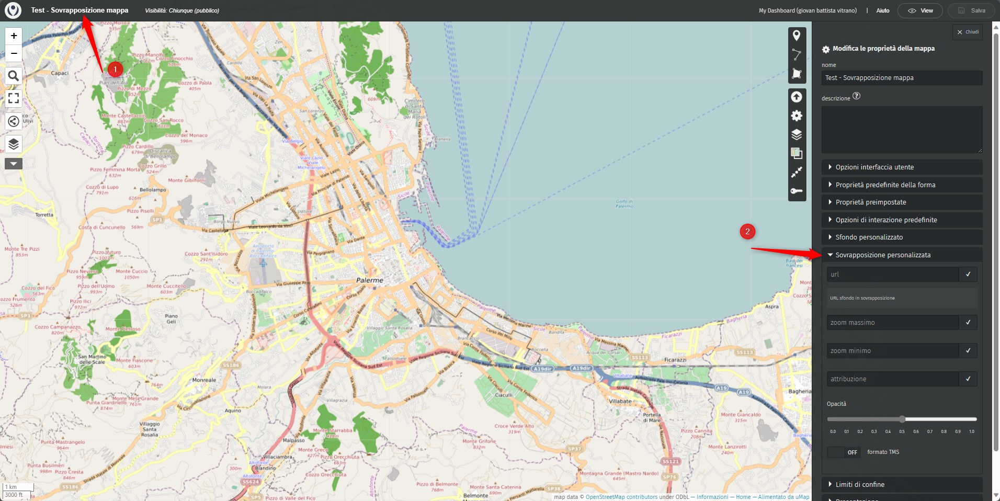

# Sovrapposizione personalizzata

**`campo URL`**: 
URL sfondo in sovrapposizione.

**`zoom massimo`**:
Stabilire il valore di zoom massimo della sovrapposzione personalizzata

**`zoom minimo`**:
Stabilire il valore di zoom minimo della sovrapposzione personalizzata

**`attribuzione`**:
Inserire ad esempio il testo: ==**Tiles © [[URL provider sfondo]]**== 

**`opacità`**:
Attribuire un valore nella scala prevista del pannello controllo "Sovrapposizione personalizzata"

**`formato TMS`**:
Il termine "TMS" si riferisce a "Tile Map Service", un protocollo per la distribuzione di mappe in forma di tile. Le mappe vengono divise in piccoli "tiles" rettangolari, ognuno con una propria posizione e zoom specifici. Questo protocollo è comunemente utilizzato per la visualizzazione di mappe online.  Il protocollo TMS è supportato da varie librerie e strumenti GIS, tra cui GDAL.

## Esempio Sovrapposizione mappa personalizzata

**1.** cliccare sul tilolo della mappa per aprire il menù principale  
**2.** cliccare nel sottomenù **Sovrapposizione mappa personalizzata** 

**3.** Inserire qui il link della mappa da sovrappore. Le mappa da sovtrapporre devo essere in formato **Tiles (Google/OSM scheme)**  
**4.** Cursore per regolare la trasparenza **Opacità** 

**5.** Per regolare la trasparenza basta agire sul cursore dell'**Opacità** 

## mapwarper.net
Per georeferenziare un'immagine di una cartografifa  e/o mappa storica e ottenenre una mappa Tiles, consigliamo di usare [https://mapwarper.net/](https://mapwarper.net/) (servizio gratuito) che dopo aver georeferenziato l'immagine permette di esportare anche in **Tiles (Google/OSM scheme)**

